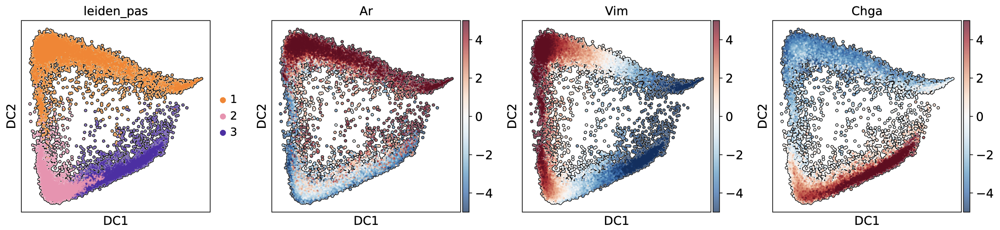

# NSD2 Paper at Nature

## NSD2 targeting reverses lineage plasticity and drug resistance in advanced prostate cancer

### This code is used to reproduce the results in the manuscript [here](https://www.biorxiv.org/content/10.1101/2023.07.18.549585v1.article-info)



## Repository Structure

```
nsd2-paper-at-nature/
├── src/
│   ├── load_dataset.py          # Script to load raw data, process with custom functions
│   ├── processing_functions.py  # Helper functions for data processing, formatting, and saving
│   └── print_charts.ipynb       # Jupyter notebook to generate figures for the manuscript
└── README.md                    # This file
```

## Prerequisites

- Python 3.8+
- Required Python packages listed at the top of `src/load_dataset.py` and `src/processing_functions.py` (e.g., `scanpy`, `pandas`, `numpy`, etc.)
- A Jupyter environment or [JupyterLab](https://jupyter.org/) to run the notebook

## Usage

Follow these two main steps to reproduce the data files and figures:

### 1. Load and Process Data

1. Open `src/load_dataset.py` in a text editor.
2. Locate the `new_data_dir` variable and set it to your data folder, e.g.:
   ```python
   new_data_dir = "/path/to/your/data/folder"
   ```
3. Run the script to download/process raw data and save results:
   ```bash
   python src/load_dataset.py
   ```
4. After completion, you will find new subdirectories under `new_data_dir`. These will be used to generate the figures.

### 2. Generate Figures

1. Launch Jupyter Notebook:
   ```bash
   jupyter notebook src/print_charts.ipynb
   ```
2. In the first cell of `print_charts.ipynb`, update the `base_path` variable to the same `new_data_dir` used above:
   ```python
   base_path = "/path/to/your/data/folder"
   ```
3. Execute all cells to recreate the figures for the paper. Outputs (plots) will be saved and rendered inline.

## File Descriptions

- **load\_dataset.py**:

  - Downloads or reads raw gene expression datasets.
  - Uses functions from `processing_functions.py` to clean, filter, and annotate data.

- **processing\_functions.py**:

  - Contains functions for:
    - Reading raw files
    - Generating and saving Gene Expression Data
    - Generating and saving Protein Activity Data

- **print\_charts.ipynb**:

  - Reads processed data from `base_path`.
  - Generates manuscript figures (e.g., DiffMaps, heatmaps, Dotplots).


## Contacts

For any info or queries please write to Alessandro Vasciaveo(avasciaveo@sbpdiscovery.org)

## License
This code is distributed under a MIT License (see [LICENSE](LICENSE)).

## Citation
If you used this work in your publication, please cite our work here:

Li, J. J. et al. NSD2 maintains lineage plasticity and castration-resistance in neuroendocrine prostate cancer. bioRxiv (2023). doi:10.1101/2023.07.18.549585 

Manuscript in review